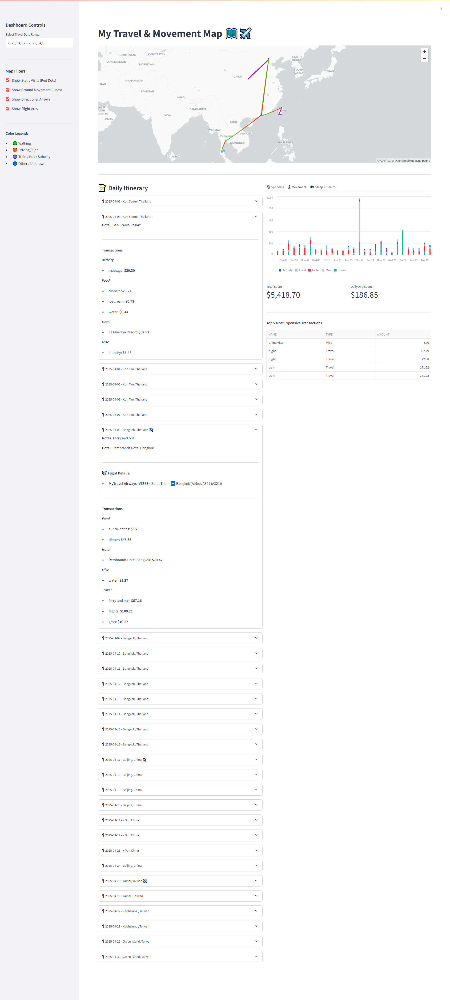

# Travel Data Databricks Project

An end-to-end data engineering pipeline built on Databricks to process, clean, and analyze personal travel, financial, and health data collected during a year-long round-the-world trip. This project serves as a robust demonstration of modern data engineering practices using PySpark, Delta Live Tables, Databricks Asset Bundles, Unity Catalog, and a Streamlit interactive frontend.

All primary ETL code and asset configurations are located inside the `travel_bundle` directory.

## 🛠️ Technology Stack & Features

* **Compute & Processing:** Databricks, PySpark (DataFrames), Spark SQL
* **Data Ingestion:** Databricks Auto Loader (`cloudFiles`) for incremental stream processing of raw JSON and CSV files
* **Orchestration:** Delta Live Tables (DLT) for declarative pipeline management and materialized views
* **Data Architecture:** Medallion Architecture (Bronze, Silver, Gold layers)
* **Data Governance & Storage:** Unity Catalog Volumes (modern, secure file storage avoiding deprecated DBFS) and Delta Lake
* **Frontend / Visualization:** Streamlit for interactive dashboards and data exploration
* **Deployment:** Databricks Asset Bundles (DABs) for CI/CD and Infrastructure as Code (IaC)
* **Testing:** Pytest for local code validation
* **Development Environment:** VS Code with Databricks Connect and Ruff formatting

## 📊 Data Sources & Medallion Architecture

The pipelines ingest multiple raw file formats into Unity Catalog Volumes and process them through a strict Medallion architecture:

### 🥉 Bronze Layer (Raw Ingestion)
Raw data is ingested incrementally via Databricks Auto Loader. Domains include:
* **Fitbit Health Metrics:** Heart rate, sleep scores, and daily steps.
* **Location Data:** Google Timeline raw JSON exports.
* **Travel Records:** Flight logs and manual travel itineraries.
* **Financials:** Raw transaction records.

### 🥈 Silver Layer (Cleansed & Conformed)
Data is cleaned, normalized, and strictly typed. Key transformations include:
* **`silver.flight_log`**: Parses complex strings using regex to extract origin/destination cities, airports, IATA/ICAO codes, and formats flight durations.
* **`silver.google_timeline`**: Explodes nested JSON arrays and structs to extract detailed activity data, visit locations, probabilities, and trip distances.
* **`silver.hourly_steps_and_heart_rate`**: Aggregates time-series health data into hourly rolling windows.
* **`silver.sleep_score`**: Categorizes daily sleep logs into qualitative metrics (Excellent, Good, Fair, Poor).

### 🥇 Gold Layer (Business Aggregates)
Highly refined data ready for analytics and the Streamlit frontend.
* **`gold.full_travel_cost`**: Joins manual daily logs with financial transactions to track localized spending (Hotel, Food, Travel, Misc), calculating daily totals, running total amounts, and running daily averages over the course of the trip.

## 📈 Streamlit Dashboard



This project includes a Streamlit application designed to connect directly to the Databricks SQL Warehouse (or cluster) to visualize the insights generated in the Gold and Silver layers. 

**Key Features of the App:**
* **Financial Tracking:** Interactive charts displaying the running total amount and running daily average of travel expenses using `gold.full_travel_cost`.
* **Health & Fitness:** Visualizations correlating hourly step counts and average heart rates, alongside sleep quality trends throughout the trip.
* **Travel Mapping:** Visual representation of flights and timeline movements using the extracted geographic data.

*(Note: Ensure your Streamlit app is configured with the correct Databricks SQL Warehouse credentials and `databricks-sql-connector` before running).*

## 🚀 Getting Started

To run this project in your own Databricks environment, follow these steps:

### 1. Cluster Setup
* Create a Databricks compute cluster. If you are using the Community Edition, select the available standard runtime.

### 2. Data Ingestion (Unity Catalog Volumes)
* **Note:** This project adheres to Databricks best practices by explicitly avoiding the deprecated DBFS (Databricks File System).
* In your Databricks workspace, navigate to **Catalog**.
* Create a Volume under your chosen catalog and schema (e.g., `/Volumes/workspace/data_landing/travel_volume/`).
* Manually upload your raw CSV and JSON files into their respective subdirectories (`fitbit/`, `flight_logs/`, `google_timeline/`, `manual_logs/`, `transactions/`) within the Volume.

### 3. Deployment & Execution (Databricks Asset Bundles)
1. Install the Databricks CLI and authenticate with your workspace.
2. Navigate to the `travel_bundle` directory:
   ```bash
   cd travel_bundle
   ```
3. Deploy the bundle to your environment:
   ```bash
   databricks bundle deploy -t dev
   ```
4. Run the pipeline job:
   ```bash
   databricks bundle run travel_pipeline_job
   ```

### 4. Running the Streamlit App

1. Navigate to the directory containing your Streamlit app.
2. Install the necessary frontend dependencies (e.g., `pip install streamlit databricks-sql-connector pandas`).
3. Set your Databricks connection environment variables (`DATABRICKS_SERVER_HOSTNAME`, `DATABRICKS_HTTP_PATH`, `DATABRICKS_TOKEN`).
4. Launch the application:
   ```bash
   streamlit run app.py
   ```
